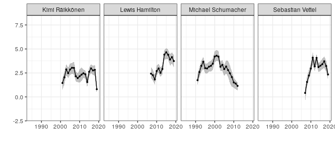
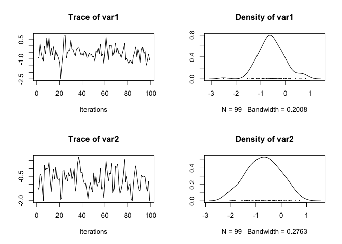
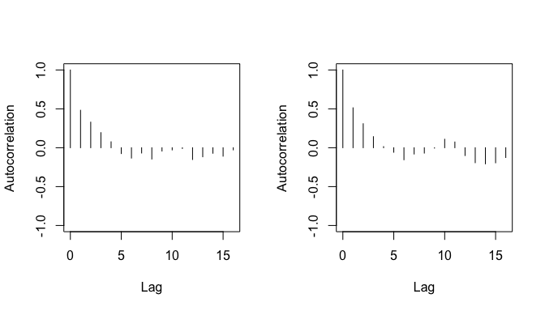
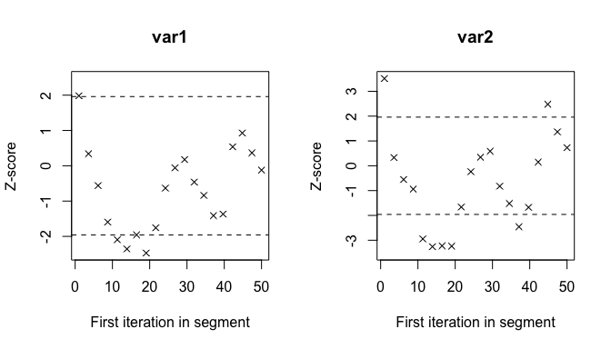
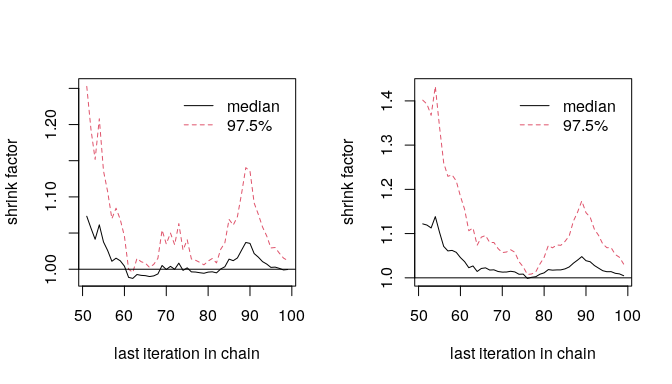
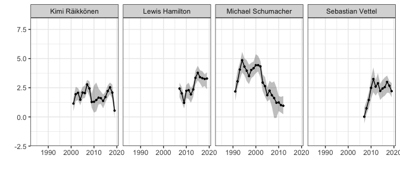

<!-- README.md is generated from README.Rmd. Please edit that file -->

# dyRank: Dynamic Rating Estimation for Ranked Data

<!-- badges: start -->

[](https://travis-ci.org/soichiroy/dyRank)
[](https://github.com/soichiroy/dyRank/actions)
<!-- badges: end -->

The goal of `dyRank` is to estimate the dynamic rating of items, players
or students based on rank-ordered data with time-index.

## Installation

You can install the development version from
[GitHub](https://github.com/) with:

``` r
# install.packages("devtools")
devtools::install_github("soichiroy/dyRank")
```

## Example: Single Ranking Type

As an example, we use `f1_race` data in the `dyRank` package.

``` r
## load package
require(dyRank)
require(tidyverse)
require(knitr)
```

``` r
## load data
## see ?f1_race for the details of this dataset
data("f1_race", package = "dyRank")
```

### Estimate rating via `dyRank()`

``` r
## set seed
set.seed(1234)

## estimate via MCMC
fit <- dyRank(
    data       = f1_race,
    var_rank   = "Pos",           
    var_player = "driver",
    var_match  = "GP",
    var_time   = "year",
    driver_fix = "Timo Glock",
    mcmc = 100, burnin = 10, thin = 1,
    truncation = 3
)
```

**Arguments**:

| Argument                                                                                                                                                                                                          | Description                                                                                                                                                                                                                                                                                                                               |
| ----------------------------------------------------------------------------------------------------------------------------------------------------------------------------------------------------------------- | ----------------------------------------------------------------------------------------------------------------------------------------------------------------------------------------------------------------------------------------------------------------------------------------------------------------------------------------- |
| `data`                                                                                                                                                                                                            | A data frame that contains variables specified in `var_rank`, `var_player`, `var_match`, `var_time`. This should be an object of either `data.frame` class or `tibble` class.                                                                                                                                                             |
| `var_rank`                                                                                                                                                                                                        | A variable name (in character) of the outcome that records the ranking. The top rank should take `1`, and all ranking values within a match (specified in `var_match`) should be consecutive. `NA` values is allowed.                                                                                                                     |
| `var_player`                                                                                                                                                                                                      | A variable name (in character) of the players.                                                                                                                                                                                                                                                                                            |
| `var_match`                                                                                                                                                                                                       | A variable name (in character) of the matches. The package allows for the panel structure, which means that the same match can repeat over time.                                                                                                                                                                                          |
| `var_time`                                                                                                                                                                                                        | A variable name of time index.                                                                                                                                                                                                                                                                                                            |
| `driver_fix`                                                                                                                                                                                                      | A name (or index) within `var_player` that is used as a reference. This should be chosen carefully, otherwise estimates will be unstable. Generally, a player who appears in multiple matches and years and who can be considered as a “middle player” is recommended as a reference.                                                     |
| `mcmc`, `burnin` and `thin` correspond to the MCMC parameters that specify the iterations, burin periods and the thinning, respectively. Default values are set small; in practice longer values are recommended. |                                                                                                                                                                                                                                                                                                                                           |
| `truncation`                                                                                                                                                                                                      | A truncation parameter that takes `1` or larger. This parameter specifies if we want to ignore players who ranked `k` or lower where `k` is the value of `truncation`. The value of `1` corresponds to the original Placket-Luce representation, but the estimation might not be stable when observations are dropped due to `NA` values. |

**Return**

`dyRank()` returns a list of two elements.

  - `lambda`: Estimated parameters stored as a list. Each element of the
    list corresponds to an iteration of the MCMC step.

<!-- end list -->

``` r
## total number of elements
length(fit$lambda)
#> [1] 99

## each element of lambda is a list of estimates for all drivers
length(fit$lambda[[1]])
#> [1] 209

## each element of lambda[[k]] is an estimate for drivers
length(fit$lambda[[1]][[1]])
#> [1] 2
```

  - `data` returns the list of formatted datasets.

<!-- end list -->

``` r
## formatted data used for the estimation
dim(fit$data$dat_ref)
#> [1] 9285    6

slice_head(as_tibble(fit$data$dat_ref), n = 5) %>%
    knitr::kable(digits = 3)
```

| years | races  | drivers         | rank\_type | id\_time | id\_driver |
| :---- | :----- | :-------------- | ---------: | -------: | ---------: |
| 1984  | brazil | Alain Prost     |          1 |        1 |          4 |
| 1984  | brazil | Keke Rosberg    |          1 |        1 |        106 |
| 1984  | brazil | Elio de Angelis |          1 |        1 |         43 |
| 1984  | brazil | Eddie Cheever   |          1 |        1 |         41 |
| 1984  | brazil | Patrick Tambay  |          1 |        1 |        153 |

``` r


## global information
fit$data$n_drivers
#> [1] 209
fit$data$n_race
#> [1] 630
```

### Obtaining the estimated rating via `get_rating()`

``` r
## get the summary of rating
rating <- get_rating(fit)

## view the estimates
slice_head(as_tibble(rating), n = 5) %>%
    knitr::kable(digits = 3)
```

| driver        | year |    2.5% |      5% |     50% |     95% |   97.5% |
| :------------ | ---: | ------: | ------: | ------: | ------: | ------: |
| Adrian Campos | 1987 | \-1.667 | \-1.582 | \-0.591 |   0.207 |   0.437 |
| Adrian Campos | 1988 | \-2.285 | \-1.992 | \-0.777 |   0.342 |   0.423 |
| Adrian Sutil  | 2007 | \-1.876 | \-1.633 | \-0.682 | \-0.175 | \-0.113 |
| Adrian Sutil  | 2008 | \-1.363 | \-1.281 | \-0.516 |   0.203 |   0.301 |
| Adrian Sutil  | 2009 | \-0.813 | \-0.638 |   0.096 |   0.726 |   0.802 |

``` r
## example visualization
drivers_use <- c("Michael Schumacher", "Lewis Hamilton", "Sebastian Vettel", "Kimi Räikkönen")

## plot rating with plot_rating()
gg <- plot_rating(rating, facet = TRUE, ncol = 4, driver_name = drivers_use)
gg + ylim(-2, 8) + xlim(1984, 2019)
```



### Assessing convergence via `get_mcmc()` and `coda` package

``` r
## load coda package
require(coda)
#> Loading required package: coda

## convert estimates to the MCMC object
mcmc_obj <- get_mcmc(fit)

## who is the first driver in the data?
names(mcmc_obj)[1]
#> [1] "Adrian Campos"

## plot the first driver's rating estimate
plot(mcmc_obj[[1]])
```



#### Checking covergence with Geweke statistics

``` r
## plot the autocorrelation
coda::autocorr.plot(mcmc_obj[[1]])
```



``` r

## geweke plot
coda::geweke.plot(mcmc_obj[[1]])
```



### Running with Multiple Chains

`dyRank` package provides a function `bind_chains()` to work with
multiple chains.

  - Store multiple chains as a list
  - `bind_chains()` with `summarize = FALSE` behaves like `get_mcmc()`
  - `bind_chains()` with `summarize = TRUE` behaves like `get_rating()`

<!-- end list -->

``` r
## load additional package for parallel
require(furrr)

## setup parallel
plan(multiprocess)

## run with multiple chains and store output as a list
n_chains <- 3
set.seed(1234)
fit_nchains <- future_map(1:n_chains, function(chains) {
    fit_tmp <- dyRank(
        data       = f1_race,
        var_rank   = "Pos",           
        var_player = "driver",
        var_match  = "GP",
        var_time   = "year",
        driver_fix = "Timo Glock",
        mcmc = 100, burnin = 10, thin = 1,
        truncation = 3
    )
}, .options = future_options(seed = TRUE))
```

#### Gelman-Rubin statistic

Multiple chains are requires to comute the Gelman-Rubin statistics
(`gelman.diag()` and `gelman.plot()` in `coda` package). `bind_chains()`
returns a list of `mcmc.list` object where each element of the returned
list corresponds to a `mcmc.list` object for each player (i.e., each
level of `var_player`).

``` r
## combine estimates into a single mcmc.list
m_list <- bind_chains(fit_nchains)

## gelman rubin statistics (for the first driver)
coda::gelman.plot(m_list[[1]])
```



#### Estimated rating (all chains combined)

We can obtain the summary statistics of the estimated rating by
specifying `summarize = TRUE` option in `bind_chains()` function. As
`bind_chains()` with `summarize = TRUE` option returns an object of
`dyRank.summary` class, a user can use `plot_raing()` function to
visualize the estimates as in the case of a single chain.

``` r
## summarise estimates by combining chains
m_summary <- bind_chains(fit_nchains, summarize = TRUE)

## class
class(m_summary)
#> [1] "tbl_df"         "tbl"            "data.frame"     "dyRank.summary"
```

## Example: Multiple Ranking Types

``` r
## load additional data
## see ?f1_grid and ?f1_laptime for the details
data("f1_grid", package = "dyRank")
data("f1_laptime", package = "dyRank")

## prepare data
f1_all <- bind_rows(f1_race, f1_grid, f1_laptime)
```

### Estimate rating via `hdyRank()`

``` r
## fit hierarhcal model
set.seed(1234)
fit_hier <- hdyRank(
    data       = f1_all,
    var_rank   = "Pos",           
    var_player = "driver",
    var_match  = "GP",
    var_time   = "year",
    var_rank_type = "rank_type",
    driver_fix = "Timo Glock",
    mcmc = 100, burnin = 10, thin = 1,
    truncation = 5
)
```

**Arguments**

  - `hdyRank()` inherits all the arguments specified in `dyRank()`.
  - It takes the additional argument `var_rank_type`: A variable name
    (in character) of the rank type. When this variable takes a single
    level (i.e., only one type of ranking), `dyRank()` should be used
    instead.

### Estimated rating

``` r
# obtain rating
rating_hier <- get_rating(fit_hier)

## example visualization
drivers_use <- c("Michael Schumacher", "Lewis Hamilton", "Sebastian Vettel", "Kimi Räikkönen")

## plot rating with plot_rating()
gg <- plot_rating(rating_hier, facet = TRUE, ncol = 4, driver_name = drivers_use)
gg + ylim(-2, 8) + xlim(1984, 2019)
```


