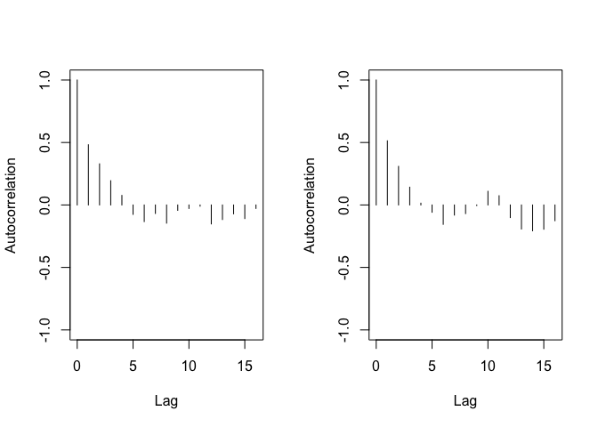
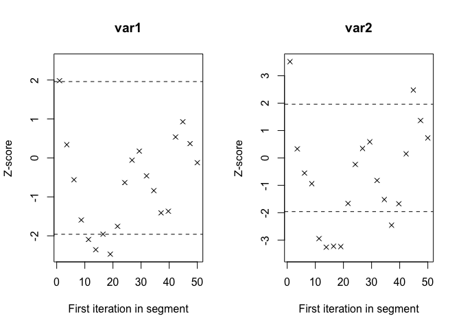

<!-- README.md is generated from README.Rmd. Please edit that file -->

# dyRank

<!-- badges: start -->

<!-- badges: end -->

The goal of `dyRank` is to estimate the dynamic rating of players based
on rank-ordered data with time-index.

## Installation

You can install the development version from
[GitHub](https://github.com/) with:

``` r
# install.packages("devtools")
devtools::install_github("sou412/dyRank")
```

## Example: Single Ranking Type

As an example, we use `f1_race` data in the `dyRank` package.

``` r
## load package 
require(dyRank)
require(tidyverse)
```

``` r
## load data 
data("f1_race", package = "dyRank")

## see ?f1_race for the details of this dataset.

## view data 
f1_race
#> # A tibble: 14,037 x 8
#>      Pos driver            Car            year  race  race_id GP     rank_type  
#>    <dbl> <chr>             <chr>          <fct> <fct> <fct>   <fct>  <fct>      
#>  1     1 Alain Prost       McLaren TAG    1984  races 466     brazil race-result
#>  2     2 Keke Rosberg      Williams Honda 1984  races 466     brazil race-result
#>  3     3 Elio de Angelis   Lotus Renault  1984  races 466     brazil race-result
#>  4     4 Eddie Cheever     Alfa Romeo     1984  races 466     brazil race-result
#>  5     5 Patrick Tambay    Renault        1984  races 466     brazil race-result
#>  6     6 Thierry Boutsen   Arrows Ford    1984  races 466     brazil race-result
#>  7     7 Marc Surer        Arrows Ford    1984  races 466     brazil race-result
#>  8     8 Jonathan Palmer   RAM Hart       1984  races 466     brazil race-result
#>  9    NA Derek Warwick     Renault        1984  races 466     brazil race-result
#> 10    NA Andrea de Cesaris Ligier Renault 1984  races 466     brazil race-result
#> # … with 14,027 more rows
```

### Estimate rating

``` r
## estimate via MCMC 
fit <- dyRank(
    data       = f1_race, 
    var_rank   = "Pos",           
    var_player = "driver", 
    var_match  = "GP",
    var_time   = "year",
    driver_fix = "Timo Glock",
    mcmc = 100, burnin = 10, thin = 1,
    truncation = 3
)
```

**Arguments**:

  - `data`: A data frame that contains variables specified in
    `var_rank`, `var_player`, `var_match`, `var_time`. This should be an
    object of either `data.frame` class or `tibble` class.
  - `var_rank`: A variable name (in character) of the outcome that
    records the ranking. The top rank should take `1`, and all ranking
    values within a match (specified in `var_match`) should be
    consecutive. `NA` values is allowed.
  - `var_player`: A variable name (in character) of the players.
  - `var_match`: A variable name (in character) of the matches. The
    package allows for the panel strucutre, which menas that the same
    match can repeat over time.
  - `var_time`: A variable name of time index.
  - `driver_fix`: A name (or index) within `var_player` that is used as
    a refenrece. This should be chosen carefully, otherwise estimates
    will be unstable. Generally, a player who appears in multiple
    matches and years and who can be considered as a “middle player” is
    recommended as a reference.
  - `mcmc`, `burnin` and `thin` correspond to the MCMC parameters that
    specify the iterations, burin periods and the thinning,
    respectively. Default values are set small; in practice longer
    values are recommended.
  - `truncation`: A truncation parameter that takes `1` or larger. This
    parameter specifies if we want to ignore players who ranked `k` or
    lower where `k` is the vlaue of `truncation`. The value of `1`
    corresponds to the original Placket-Luce representation, but the
    estimation might not be stable when observations are dropped due to
    `NA` values.

**Return**

`dyRank()` returns a list of two elements.

  - `lambda`: Estimated parameters stored as a list. Each element of the
    list corresponds to an interation of the MCMC step.

<!-- end list -->

``` r
## total number of elements
length(fit$lambda)
#> [1] 99

## each element of lambda is a list of estimates for all drivers
length(fit$lambda[[1]])
#> [1] 209

## each element of lambda[[k]] is an estimate for drivers
length(fit$lambda[[1]][[1]])
#> [1] 2
```

  - `data` returns the list of formatted datasets.

<!-- end list -->

``` r
## formatted data used for the estimation 
fit$data$dat_ref
#> # A tibble: 9,285 x 6
#>    years races        drivers         rank_type id_time id_driver
#>    <fct> <fct>        <chr>               <dbl>   <dbl>     <dbl>
#>  1 1984  brazil       Alain Prost             1       1         4
#>  2 1984  brazil       Keke Rosberg            1       1       106
#>  3 1984  brazil       Elio de Angelis         1       1        43
#>  4 1984  brazil       Eddie Cheever           1       1        41
#>  5 1984  brazil       Patrick Tambay          1       1       153
#>  6 1984  brazil       Thierry Boutsen         1       1       196
#>  7 1984  brazil       Marc Surer              1       1       118
#>  8 1984  brazil       Jonathan Palmer         1       1        95
#>  9 1984  south-africa Niki Lauda              1       1       142
#> 10 1984  south-africa Alain Prost             1       1         4
#> # … with 9,275 more rows

## global information
fit$data$n_drivers
#> [1] 209
fit$data$n_race
#> [1] 630
```

### Obtaining the summary estimates

``` r
## get the summary of rating 
rating <- get_rating(fit)

## view the estimates 
rating
#> # A tibble: 1,103 x 7
#>    driver         year `2.5%`   `5%`   `50%`  `95%` `97.5%`
#>    <chr>         <int>  <dbl>  <dbl>   <dbl>  <dbl>   <dbl>
#>  1 Adrian Campos  1987 -1.42  -1.32  -0.584   0.424  0.631 
#>  2 Adrian Campos  1988 -2.00  -1.89  -0.705   0.324  0.434 
#>  3 Adrian Sutil   2007 -1.33  -1.22  -0.755  -0.192 -0.0966
#>  4 Adrian Sutil   2008 -1.30  -1.23  -0.573  -0.181 -0.0922
#>  5 Adrian Sutil   2009 -0.530 -0.456  0.101   0.553  0.594 
#>  6 Adrian Sutil   2010  0.131  0.315  0.895   1.38   1.47  
#>  7 Adrian Sutil   2011  0.535  0.580  1.01    1.39   1.65  
#>  8 Adrian Sutil   2012  0.162  0.189  0.877   1.45   1.65  
#>  9 Adrian Sutil   2013  0.183  0.222  0.639   0.995  1.07  
#> 10 Adrian Sutil   2014 -0.734 -0.607 -0.0505  0.561  0.752 
#> # … with 1,093 more rows
```

``` r
## example visualization 
drivers_use <- c("Michael Schumacher", "Lewis Hamilton", "Sebastian Vettel", "Kimi Räikkönen")

## plot using ggplot()
rating %>% 
    filter(driver %in% drivers_use) %>% 
    ggplot(aes(x = year, y = `50%`)) + 
        geom_ribbon(aes(ymin = `5%`, ymax = `95%`), alpha = 0.3) + 
        geom_line() + 
        geom_point(size = 0.7) + 
        theme_bw() + 
        labs(y = "Rating", x = '') + 
        facet_wrap(~driver, ncol = 4) + 
        ylim(-2, 8) + 
        xlim(1984, 2019)
```


### Assessing the estimates

``` r
## load coda package 
require(coda)
#> Loading required package: coda

## convert estimates to the MCMC object 
mcmc_obj <- get_mcmc(fit)

## who is the first driver in the data?
names(mcmc_obj)[1]
#> [1] "Adrian Campos"

## plot the first driver's rating estimate 
plot(mcmc_obj[[1]])
```


``` r

## plot the autocorrelation 
autocorr.plot(mcmc_obj[[1]])
```



``` r

## geweke plot 
geweke.plot(mcmc_obj[[1]])
```


