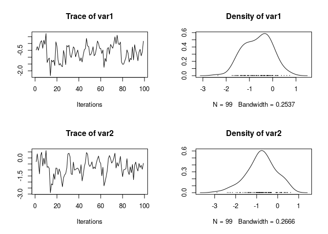
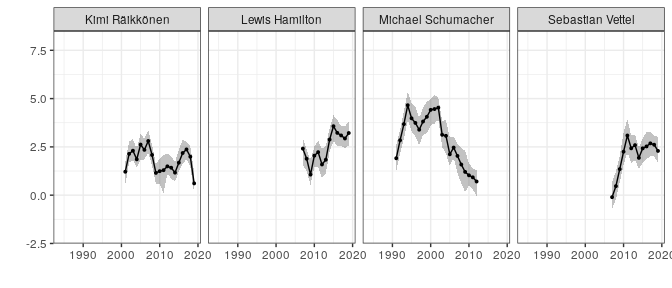

<!-- README.md is generated from README.Rmd. Please edit that file -->

dyRank: Dynamic Rating Estimation for Ranked Data
=================================================

<!-- badges: start -->

<!-- badges: end -->

The goal of `dyRank` is to estimate the dynamic rating of items, players
or students based on rank-ordered data with time-index.

Installation
------------

You can install the development version from
[GitHub](https://github.com/) with:

    # install.packages("devtools")
    devtools::install_github("soichiroy/dyRank")

Example: Single Ranking Type
----------------------------

As an example, we use `f1_race` data in the `dyRank` package.

    ## load package 
    require(dyRank)
    require(tidyverse)

    ## load data 
    data("f1_race", package = "dyRank")

    ## see ?f1_race for the details of this dataset.

    ## view data 
    f1_race
    #> # A tibble: 14,037 x 8
    #>      Pos driver            Car            year  race  race_id GP     rank_type  
    #>    <dbl> <chr>             <chr>          <fct> <fct> <fct>   <fct>  <fct>      
    #>  1     1 Alain Prost       McLaren TAG    1984  races 466     brazil race-result
    #>  2     2 Keke Rosberg      Williams Honda 1984  races 466     brazil race-result
    #>  3     3 Elio de Angelis   Lotus Renault  1984  races 466     brazil race-result
    #>  4     4 Eddie Cheever     Alfa Romeo     1984  races 466     brazil race-result
    #>  5     5 Patrick Tambay    Renault        1984  races 466     brazil race-result
    #>  6     6 Thierry Boutsen   Arrows Ford    1984  races 466     brazil race-result
    #>  7     7 Marc Surer        Arrows Ford    1984  races 466     brazil race-result
    #>  8     8 Jonathan Palmer   RAM Hart       1984  races 466     brazil race-result
    #>  9    NA Derek Warwick     Renault        1984  races 466     brazil race-result
    #> 10    NA Andrea de Cesaris Ligier Renault 1984  races 466     brazil race-result
    #> # … with 14,027 more rows

### Estimate rating via `dyRank()`

    ## set seed
    set.seed(1234)

    ## estimate via MCMC 
    fit <- dyRank(
        data       = f1_race, 
        var_rank   = "Pos",           
        var_player = "driver", 
        var_match  = "GP",
        var_time   = "year",
        driver_fix = "Timo Glock",
        mcmc = 100, burnin = 10, thin = 1,
        truncation = 3
    )

**Arguments**:

-   `data`: A data frame that contains variables specified in
    `var_rank`, `var_player`, `var_match`, `var_time`. This should be an
    object of either `data.frame` class or `tibble` class.
-   `var_rank`: A variable name (in character) of the outcome that
    records the ranking. The top rank should take `1`, and all ranking
    values within a match (specified in `var_match`) should be
    consecutive. `NA` values is allowed.
-   `var_player`: A variable name (in character) of the players.
-   `var_match`: A variable name (in character) of the matches. The
    package allows for the panel strucutre, which menas that the same
    match can repeat over time.
-   `var_time`: A variable name of time index.
-   `driver_fix`: A name (or index) within `var_player` that is used as
    a refenrece. This should be chosen carefully, otherwise estimates
    will be unstable. Generally, a player who appears in multiple
    matches and years and who can be considered as a “middle player” is
    recommended as a reference.
-   `mcmc`, `burnin` and `thin` correspond to the MCMC parameters that
    specify the iterations, burin periods and the thinning,
    respectively. Default values are set small; in practice longer
    values are recommended.
-   `truncation`: A truncation parameter that takes `1` or larger. This
    parameter specifies if we want to ignore players who ranked `k` or
    lower where `k` is the vlaue of `truncation`. The value of `1`
    corresponds to the original Placket-Luce representation, but the
    estimation might not be stable when observations are dropped due to
    `NA` values.

**Return**

`dyRank()` returns a list of two elements.

-   `lambda`: Estimated parameters stored as a list. Each element of the
    list corresponds to an interation of the MCMC step.

<!-- -->

    ## total number of elements
    length(fit$lambda)
    #> [1] 99

    ## each element of lambda is a list of estimates for all drivers
    length(fit$lambda[[1]])
    #> [1] 209

    ## each element of lambda[[k]] is an estimate for drivers
    length(fit$lambda[[1]][[1]])
    #> [1] 2

-   `data` returns the list of formatted datasets.

<!-- -->

    ## formatted data used for the estimation 
    fit$data$dat_ref
    #> # A tibble: 9,285 x 6
    #>    years races        drivers         rank_type id_time id_driver
    #>    <fct> <fct>        <chr>               <dbl>   <dbl>     <dbl>
    #>  1 1984  brazil       Alain Prost             1       1         4
    #>  2 1984  brazil       Keke Rosberg            1       1       106
    #>  3 1984  brazil       Elio de Angelis         1       1        43
    #>  4 1984  brazil       Eddie Cheever           1       1        41
    #>  5 1984  brazil       Patrick Tambay          1       1       153
    #>  6 1984  brazil       Thierry Boutsen         1       1       196
    #>  7 1984  brazil       Marc Surer              1       1       118
    #>  8 1984  brazil       Jonathan Palmer         1       1        95
    #>  9 1984  south-africa Niki Lauda              1       1       142
    #> 10 1984  south-africa Alain Prost             1       1         4
    #> # … with 9,275 more rows

    ## global information
    fit$data$n_drivers
    #> [1] 209
    fit$data$n_race
    #> [1] 630

### Obtaining the estimated rating via `get_rating()`

    ## get the summary of rating 
    rating <- get_rating(fit)

    ## view the estimates 
    rating
    #> # A tibble: 1,103 x 7
    #>    driver         year  `2.5%`    `5%`   `50%`  `95%` `97.5%`
    #>    <chr>         <int>   <dbl>   <dbl>   <dbl>  <dbl>   <dbl>
    #>  1 Adrian Campos  1987 -1.67   -1.58   -0.591   0.207   0.437
    #>  2 Adrian Campos  1988 -2.28   -1.99   -0.777   0.342   0.423
    #>  3 Adrian Sutil   2007 -1.88   -1.63   -0.682  -0.175  -0.113
    #>  4 Adrian Sutil   2008 -1.36   -1.28   -0.516   0.203   0.301
    #>  5 Adrian Sutil   2009 -0.813  -0.638   0.0959  0.726   0.802
    #>  6 Adrian Sutil   2010  0.201   0.332   0.932   1.45    1.49 
    #>  7 Adrian Sutil   2011  0.430   0.485   1.11    1.64    1.66 
    #>  8 Adrian Sutil   2012 -0.0784 -0.0519  0.932   1.61    1.69 
    #>  9 Adrian Sutil   2013 -0.0915 -0.0614  0.710   1.27    1.28 
    #> 10 Adrian Sutil   2014 -1.08   -0.881  -0.108   0.557   0.589
    #> # … with 1,093 more rows

    ## example visualization 
    drivers_use <- c("Michael Schumacher", "Lewis Hamilton", "Sebastian Vettel", "Kimi Räikkönen")

    ## plot rating with plot_rating()
    gg <- plot_rating(rating, facet = TRUE, ncol = 4, driver_name = drivers_use)
    gg + ylim(-2, 8) + xlim(1984, 2019)

### Assessing convergence via `get_mcmc()` and `coda` package

    ## load coda package 
    require(coda)
    #> Loading required package: coda

    ## convert estimates to the MCMC object 
    mcmc_obj <- get_mcmc(fit)

    ## who is the first driver in the data?
    names(mcmc_obj)[1]
    #> [1] "Adrian Campos"

    ## plot the first driver's rating estimate 
    plot(mcmc_obj[[1]])

#### Checking covergence with Geweke statistics

    ## plot the autocorrelation 
    coda::autocorr.plot(mcmc_obj[[1]])

    ## geweke plot 
    coda::geweke.plot(mcmc_obj[[1]])

### Running with Multiple Chains

`dyRank` package provides a function `bind_chains()` to work with
multiple chains.

-   Store multiple chains as a list
-   `bind_chains()` with `summarize = FALSE` behaves like `get_mcmc()`
-   `bind_chains()` with `summarize = behaves` like `get_rating()`

<!-- -->

    ## load additional package for parallel
    require(furrr)

    ## setup parallel 
    plan(multiprocess)

    ## run with multiple chains and store output as a list
    n_chains <- 3
    set.seed(1234)
    fit_nchains <- future_map(1:n_chains, function(chains) {
        fit_tmp <- dyRank(
            data       = f1_race, 
            var_rank   = "Pos",           
            var_player = "driver", 
            var_match  = "GP",
            var_time   = "year",
            driver_fix = "Timo Glock",
            mcmc = 100, burnin = 10, thin = 1,
            truncation = 3
        )
    }, .options = future_options(seed = TRUE))

#### Gelman-Rubin statistic

Multiple chains are requires to comute the Gelman-Rubin statistics
(`gelman.diag()` and `gelman.plot()` in `coda` package). `bind_chains()`
returns a list of `mcmc.list` object where each element of the returned
list corresponds to a `mcmc.list` object for each player (i.e., each
level of `var_player`).

    ## combine estimates into a single mcmc.list 
    m_list <- bind_chains(fit_nchains)

    ## gelman rubin statistics (for the first driver)
    coda::gelman.plot(m_list[[1]])

#### Estimated rating (all chains combined)

We can obtain the summary statistics of the estimated rating by
specifying `summarize = TRUE` option in `bind_chains()` function. As
`bind_chains()` with `summarize = TRUE` option returns an object of
`dyRank.summary` class, a user can use `plot_raing()` function to
visualize the estimates as in the case of a single chain.

    ## summarise estimates by combining chains 
    m_summary <- bind_chains(fit_nchains, summarize = TRUE)

    ## view the output 
    m_summary
    #> # A tibble: 1,103 x 7
    #>    driver         year  `2.5%`    `5%`   `50%`  `95%` `97.5%`
    #>    <chr>         <int>   <dbl>   <dbl>   <dbl>  <dbl>   <dbl>
    #>  1 Adrian Campos  1987 -1.81   -1.62   -0.518   0.420  0.595 
    #>  2 Adrian Campos  1988 -2.14   -1.89   -0.722   0.322  0.516 
    #>  3 Adrian Sutil   2007 -1.55   -1.45   -0.807  -0.284 -0.213 
    #>  4 Adrian Sutil   2008 -1.35   -1.24   -0.670  -0.112  0.0272
    #>  5 Adrian Sutil   2009 -0.526  -0.469   0.0452  0.595  0.721 
    #>  6 Adrian Sutil   2010  0.252   0.308   0.766   1.35   1.53  
    #>  7 Adrian Sutil   2011  0.423   0.493   0.991   1.47   1.55  
    #>  8 Adrian Sutil   2012 -0.0521  0.0697  0.780   1.52   1.61  
    #>  9 Adrian Sutil   2013  0.0275  0.0703  0.619   1.08   1.14  
    #> 10 Adrian Sutil   2014 -0.844  -0.765  -0.164   0.316  0.434 
    #> # … with 1,093 more rows

    ## class 
    class(m_summary)
    #> [1] "tbl_df"         "tbl"            "data.frame"     "dyRank.summary"

Example: Multiple Ranking Types
-------------------------------

    ## load additional data 
    ## see ?f1_grid and ?f1_laptime for the details 
    data("f1_grid", package = "dyRank")
    data("f1_laptime", package = "dyRank")

    ## prepare data 
    f1_all <- bind_rows(f1_race, f1_grid, f1_laptime)

### Estimate rating via `hdyRank()`

    ## fit hierarhcal model
    set.seed(1234)
    fit_hier <- hdyRank(
        data       = f1_all,
        var_rank   = "Pos",           
        var_player = "driver", 
        var_match  = "GP",
        var_time   = "year",
        var_rank_type = "rank_type",
        driver_fix = "Timo Glock",
        mcmc = 100, burnin = 10, thin = 1, 
        truncation = 5
    )

**Arguments**

-   `hdyRank()` inherits all the arguments specified in `dyRank()`.
-   It takes the additional argument `var_rank_type`: A variable name
    (in character) of the rank type. When this variable takes a single
    level (i.e., only one type of ranking), `dyRank()` should be used
    instead.

### Estimated rating

    # obtain rating 
    rating_hier <- get_rating(fit_hier)

    ## example visualization 
    drivers_use <- c("Michael Schumacher", "Lewis Hamilton", "Sebastian Vettel", "Kimi Räikkönen")

    ## plot rating with plot_rating()
    gg <- plot_rating(rating_hier, facet = TRUE, ncol = 4, driver_name = drivers_use)
    gg + ylim(-2, 8) + xlim(1984, 2019)

